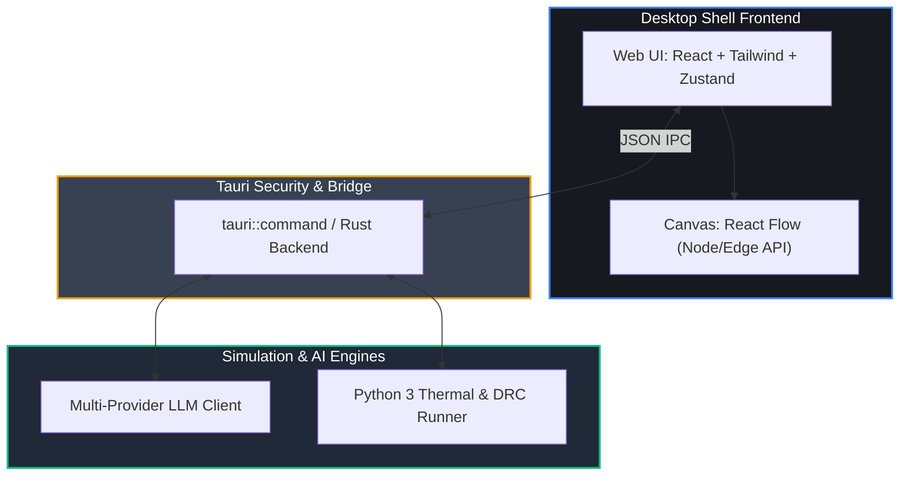

<div align="center">
  
  <h1>AHA Designer</h1>
  <p><b>The Intelligent, AI-Driven Hardware Architecture Synthesis Platform.</b></p>
  
  [](https://opensource.org/licenses/MIT)
  [](https://www.rust-lang.org/)
  [](https://reactflow.dev/)
  [](https://v2.tauri.app/)
  [](#)
</div>

<br />

> **AHA Designer (AI Hardware Architect Designer)** is an enterprise-grade Electronic Design Automation (EDA) tool that merges the declarative power of Large Language Models with deterministic, physics-based execution engines.

Transform hardware engineering from manual schematic drafting into intelligent, prompt-driven architecture topology synthesis. Build complex Edge AI compute nodes, IoT gateways, and mixed-signal boards in minutes instead of weeks.

---

## ✨ Features

- **� Multi-Model Copilot**
  Native support for OpenAI `gpt-4o`, Aliyun `Qwen`, `DeepSeek`, and local private `Ollama` models. Chat naturally with your AI architect, rendered in rich GitHub-flavored Markdown.
- **🎨 Infinite Node Canvas**
  Powered by `React Flow`. Experience a buttery-smooth dark UI with semantic zooming, snap-to-grid, orthogonal auto-routing, custom EDA pin/port nodes, and right-click context menus.
- **⚡ Temporal Action State**
  Never lose your work. Industry-standard hierarchical Undo/Redo (`Ctrl+Z` / `Ctrl+Y`) built deep into the graph state using Zustand's temporal middleware.
- **🔍 Advanced Design Rule Checks (DRC)**
  Validate your graph against a native Python execution engine instantly. Catch missing thermal thresholds, mismatched power domains, and calculate instantaneous power aggregations (TDP).
- **📦 Realistic Component Library**
  A dynamic, visually polished component library with real Manufacturer branding (NVIDIA, STM, Sony), search filtering, and drag-and-drop IC instantiation.
- **� BOM Export Pipeline**
  One-click extraction of your entire architecture into a standards-compliant CSV Bill of Materials for downstream procurement.

## 🚀 Production-Grade Interactions

- **Workspace File I/O (`.aha.json`)**
  Load/save complete architecture state through native desktop dialogs (Rust/Tauri backend file commands, not mock local-only state).
- **Live Component Search (TrustedParts API)**
  Query real market inventory and offers, then drag real parts into the canvas as nodes with manufacturer/MPN/offer metadata.
- **Advanced Editing UX**
  Keyboard-first operations for power users:
  `Ctrl/Cmd+S` save workspace, `Ctrl/Cmd+D` duplicate selected node, `Delete/Backspace` remove selected node.
- **Auto-Recovery Draft**
  Continuous local draft persistence to protect in-progress work during crashes or forced restarts.

## 🏗️ Architecture Stack

AHA Designer uses a modern, blazingly fast polyglot monorepo stack designed for high-performance and deep OS integration.



## � Getting Started

### Prerequisites

Ensure you have the following installed on your host machine:

- [Node.js](https://nodejs.org/) (v20+)
- [pnpm](https://pnpm.io/) (v9+)
- [Rust Toolchain](https://rustup.rs/) (stable, 1.84+)
- Python 3.11+ (For execution plugins)

### Installation & Launch

1. **Clone the repository:**

   ```bash
   git clone https://github.com/your-org/aha-designer.git
   cd aha-designer
   ```

2. **Initialize Python Environment:**
   Setup the simulation engine runner requirements.

   ```bash
   pip3 install -r simulator/python-runner/requirements.txt
   ```

3. **Install Monorepo Dependencies:**

   ```bash
   pnpm install
   ```

4. **Launch the Developer Environment:**
   This command orchestrates both the Vite UI hot-reloading server and the Rust Tauri application window simultaneously.
   ```bash
   pnpm run tauri dev
   ```

## 🧪 Testing and CI

AHA Designer guarantees continuous quality through automated E2E testing and type checks.

- **Check Rust Backend:** `cargo check --manifest-path apps/desktop/src-tauri/Cargo.toml`
- **Unit Tests (Rust):** `cargo test --manifest-path apps/desktop/src-tauri/Cargo.toml`
- **E2E Tests (Playwright):** `cd tests && pnpm test`

## 🛡️ License

This project is licensed under the [MIT License](LICENSE).

---

<div align="center">
  <i>Redefining Hardware Architecture, One Prompt at a Time.</i>
</div>
